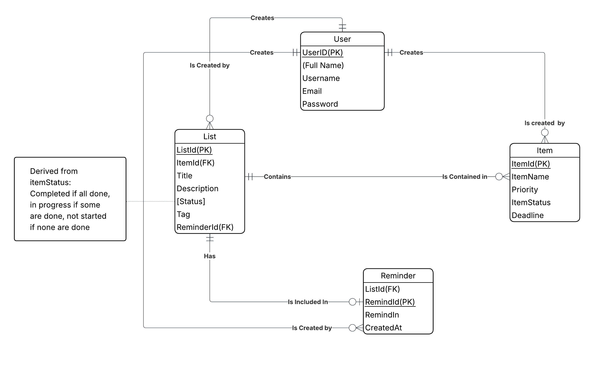

# To-Do List App

## Description

A task organizer program that allows the user to create lists with specific tags to differentiate between task categories. 
Users can also create reminders for each list to be reminded of ongoing tasks to complete. Lists will also organize items 
by priority, items with a deadline with be at the top of the lists whereas items without deadlines will be lower. The deadlines
for each task will also send a reminder to the user of the upcoming deadline approaching. 

## ERD/Business Rules

Business Rules:
A USER may create many items. An ITEM must be created by exactly one USER.  
A USER may create many lists. A LIST must be created by exactly one USER.  
A USER may create many REMINDERS. A REMINDER must be created by exactly one  USER.  
A LIST may have a REMINDER. A REMINDER must have exactly one LIST.  
A LIST may contain many items. An ITEM must be contained in exactly one LIST.  

